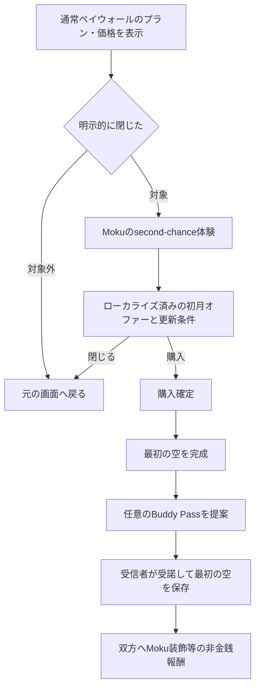

# Second-chance paywall 意思決定記録

最終更新: 2026-09-08

状態: **会議中・未実装**

対象: 通常ペイウォールを閉じた利用者へ提示する「初月だけ低価格」オファーと、紹介導線との関係

## 1. この文書の役割

Codex と依頼者の会議で決まった内容を、将来の実装へ正確に渡すための記録である。

- `決定` の項目だけを実装してよい。
- `提案` と `未決` はコードへ取り込まない。
- 決定時は、日付、決定者、対象コード、反証・撤回条件を「決定ログ」に追記する。
- 実装前に本書と `PRODUCT-MODEL.md` を読み、価格・商品・紹介成立条件を推測で補わない。

## 2. 狙う指標

**対象指標:** second-chance paywall 対象者の購入確定率

**定義:** `skygrid_second_chance_purchase_confirmed` / `skygrid_second_chance_presented`

**現在値:** 未測定。既存 GA4 は `skygrid_paywall_presented` が12件・5ユーザーであり、判断できる標本ではない。

**変更しない場合:** 通常ペイウォールを明示的に閉じた利用者に再提案する機会はなく、その離脱を回収できない。

紹介を組み合わせる場合は、購入率とは別に次のループを測る。

```text
オファーまたは購入後の誘因
  → 招待者が紹介する
  → 招待リンクが外部へ届く
  → 受信者がアプリ内で招待を受諾する
  → 受信者が最初の空を保存する
  → Buddy体験が生まれ、次の紹介につながる
```

共有シートを開いた回数だけを紹介成立とは扱わない。

## 3. 現在確認できている実装

- `PaywallView` は終了理由を `.close`、`.continueWithFree`、`.interactiveDismissal` に分けて記録できる。
- 通常商品の表示価格と購入は `PurchasesServicing` / RevenueCat の offering と package を使用する。
- `PaywallAnalytics` は通常ペイウォールの表示、ステップ、購入開始、購入確定、終了理由を記録する。
- 初月割引商品の取得、利用資格、更新価格、地域別価格を表すアプリ内契約はまだない。
- 「紹介した」「相手が受諾した」「相手が初回撮影した」を割引資格へ結び付ける契約はまだない。
- 過去の `ExitOffer` は、実在を保証できない `SKYGRID20` をハードコードし、価格を見る前にも表示できたため削除された。今回の案は同じ方式を復活させてはならない。

## 4. 決定済み

| 項目 | 決定 | 根拠 | 実装への影響 |
|---|---|---|---|
| 表現方針 | 「静かな朝」を制約として扱わず、Mokuの感情表現、アニメーション、華やかな演出を利用できる | 依頼者判断 | second-chance体験は既存の遊び心ある表現に合わせる |
| 商品情報 | `$1` 等の文字列をアプリへ固定せず、StoreKit / RevenueCat が返すローカライズ済み価格と更新条件を表示する | 現行購入契約と過去のExitOffer失敗 | 商品が取得できない場合は架空の割引を表示しない |
| 実装手順 | 会議で下記の未決事項が決まった後、その決定単位で実装・検証する | 依頼者判断 | 現時点では課金商品、画面、紹介ゲートを実装しない |

## 5. 現在の提案

以下は設計案であり、まだ決定ではない。



画面案:

- 目を潤ませたMokuが短く登場し、「ちょっと待って！ 最初の1か月を試してみない？」と呼びかける。
- 値引き額、対象期間、その後の更新価格、解約可能時期を同じ画面で読めるようにする。
- Reduce Motion 設定では表情の静止状態へ縮退する。
- 同じ利用者へ繰り返し割り込まないよう、提示回数または再提示間隔を持つ。

紹介条件についての作業仮説:

- **Bet:** 購入前の割引を「紹介必須」にすると、紹介の質と購入完了率が下がる可能性がある。
- **仮定:** 利用者は価値体験前の義務的共有を避け、自己送信などで条件だけを満たそうとする。
- **最安検証:** まず紹介条件を付けずにsecond-chance単体を50/50で検証し、その後、購入・初回撮影後の任意Buddy Passを別実験にする。
- **終了条件:** 購入確定率が改善しない、無料継続率が悪化する、または再表示による終了が増える場合はsecond-chanceを停止する。Buddy Passは受信者の受諾・初回撮影が増えない場合に停止する。

## 6. 会議で決める事項

| # | 議題 | 選択肢・決める内容 | 状態 |
|---|---|---|---|
| 1 | 提示トリガー | プラン価格表示後の `.close` のみか、他の終了理由も含めるか | 未決 |
| 2 | 提示頻度 | 1アカウント1回、一定日数後に再提示、別条件 | 未決 |
| 3 | 商品契約 | 対象プラン、初月価格、対象地域、2か月目以降の価格、既存購読者の扱い | 未決 |
| 4 | オファー資格 | 全員、Apple/RevenueCatのintro eligibility、独自セグメント | 未決 |
| 5 | 画面 | 文言、Mokuの表情、アニメーション時間、音・触覚、閉じ方 | 未決 |
| 6 | 紹介との関係 | 購入前の必須条件、購入後の任意Buddy Pass、紹介を分離 | 未決 |
| 7 | 紹介成立 | 共有、インストール、招待受諾、初回撮影のどれを成立とするか | 未決 |
| 8 | 報酬 | 招待者・受信者への価格特典、Moku装飾、共有カード等 | 未決 |
| 9 | 実験 | 対象者、割付、必要標本、期間、停止条件 | 未決 |
| 10 | 障害時 | offering取得失敗、オフライン、購入保留、紹介未完了時の表示 | 未決 |

## 7. 実装開始条件

次の項目が決定ログで `決定` になってから、該当範囲を実装する。

| 実装範囲 | 開始条件 | 主な対象 |
|---|---|---|
| second-chance表示制御 | 議題1・2の決定 | `PaywallView`、`RootView`、`LocalDefaults` |
| 価格・購入 | 議題3・4の決定とASC/RevenueCatの商品準備 | `PurchasesServicing`、`RevenueCatService`、購入UI |
| Moku画面 | 議題5の決定 | Paywall UI、アクセシビリティ、ローカライズ |
| 紹介連携 | 議題6〜8の決定 | Invite/Buddy、Functions、資格状態 |
| 計測・実験 | 議題9・10の決定 | `PaywallAnalytics`、実験割付、失敗時処理 |

受け入れ条件:

- 表示価格と更新条件が StoreKit / RevenueCat の実商品と一致する。
- 明示的な終了経路があり、同じセッションで画面が循環しない。
- 購入、復元、保留、キャンセル、オフラインを区別して処理する。
- VoiceOver、Dynamic Type、Reduce Motion で主要操作が完了できる。
- 紹介を採用する場合、分母から受信者の初回撮影まで計測できる。
- second-chanceと紹介施策の効果を別々に判定できる。

## 8. 決定ログ

| 日付 | 決定者 | 区分 | 内容 | 対象 | 状態 |
|---|---|---|---|---|---|
| 2026-09-08 | 依頼者 | 表現方針 | 「静かな朝」を破棄し、より派手で感情的な体験を許容する | 全ユーザー向け画面 | 決定 |
| 2026-09-08 | 依頼者・Codex | 進め方 | 本書を会議記録とし、会議で確定した決定に従って段階的にコーディングする | second-chance paywall | 決定 |
| 2026-09-08 | Codex提案 | 紹介 | 購入前の紹介必須化を避け、購入・初回撮影後の任意Buddy Passとして別検証する | 紹介ループ | 提案 |
