# UI 画面遷移図・一次監査（2026-07-30）

対象は `ios/SkyGrid/Sources` の実装である。モックアップや企画書ではなく、`RootView`、各 `NavigationLink`、`sheet`、`fullScreenCover` を読み取り、実際に到達可能な経路だけを記録した。以降のシミュレーター確認では、この図の全ての入口と終了経路を操作して確認する。

```mermaid
flowchart TD
    Launch[起動] --> Startup{AppStartupView}
    Startup -->|接続・設定成功| Gate{onboardingDone}
    Startup -->|接続失敗| StartupError[セットアップ/接続エラー]
    StartupError -->|Try again| Startup

    Gate -->|false| Welcome[Onboarding 1: Welcome]
    Welcome --> Profile[Onboarding 2: Morning intent]
    Profile --> WakeGoal[Onboarding 3: Wake time]
    WakeGoal --> Plan[Onboarding 4: Personalized plan]
    Plan -->|Start with Free| Today
    Plan -->|Explore Pro| OnboardingPaywall[Paywall]
    OnboardingPaywall -->|Close / Continue with Free| Today
    OnboardingPaywall -->|Offer code configured| ExitOffer[Exit offer]
    ExitOffer -->|Continue / Close / redeem完了| Today

    Gate -->|true| Today[Today タブ]
    Today <-->|タブ切替| Grid[Sky Grid タブ]
    Today -->|Capture the sky| Camera[カメラ: Live]
    AlarmRoute[アラーム/通知] -->|pendingRoute| Camera
    Camera -->|Shutter| CameraReview[カメラ: Review]
    CameraReview -->|Retake| Camera
    CameraReview -->|Use this one・投稿成功| Today
    Camera -->|失敗| CameraFailure[カメラ: Failure]
    CameraFailure -->|Try again| Camera

    Today -->|Morning alarm| AlarmSettings[Morning Alarm]
    Today -->|Buddies| Buddies[Buddies]
    Today -->|Settings| Settings[Settings]
    Grid -->|Share| ShareSheet[システム共有シート]
    Grid -->|Unlock full archive| ArchivePaywall[Paywall]

    Buddies -->|handle未設定| Handle[Handle claim]
    Buddies -->|handle設定済み| AddBuddy[Add buddy]
    Buddies -->|受信申請| Requests[Friend requests]
    Buddies -->|既存 buddy| BuddySafety[Buddy safety]
    BuddySafety -->|Block| BlockConfirm[確認アラート]
    BuddySafety -->|Report| ReportResult[結果アラート]

    Settings --> AlarmSettings
    Settings --> CommunitySafety[Community & Safety]
    Settings --> AccountDeletion[Delete account]
    AccountDeletion --> DeleteConfirm[削除確認]
    Settings --> SettingsPaywall[Paywall]

    OnboardingPaywall -.->|購入/復元| Today
    ArchivePaywall -.->|購入/復元/閉じる| Grid
    SettingsPaywall -.->|購入/復元/閉じる| Settings
```

## 監査の前提

- `NavigationStack` 内の詳細画面は、標準の戻る操作で親画面へ戻る。
- システム共有シート、アラート、ペイウォールにはコード上の終了経路がある。
- `CameraView` は `RootView` の `fullScreenCover` で表示され、カメラを終了するためには親の `showCamera` を `false` に戻す必要がある。

## 図から見つかった一次問題

| 優先度 | 観測した事実 | 影響 | 改善方針 |
| --- | --- | --- | --- |
| P0（修正済み） | `CameraView` は Live / Review / Failure のいずれにも閉じる操作を持たず、`RootView.showCamera` を false にするコールバックも持たなかった。 | 誤って撮影を開いた人、権限拒否・カメラ失敗になった人、アラームから開いた人が Today へ戻れない。フルスクリーン画面として遷移が閉じていた。 | `onDismiss` を親から注入し、Live / Review には 44pt の閉じるボタン、Failure には明示的な「Close camera」を追加した。 |
| P1 | オンボーディングは 4 段階すべてが前進のみで、選択した意図や時刻を前の段階で修正できない。 | 初回設定での小さな誤操作が、アプリ終了以外では修正不能。 | カメラ修正後、シミュレーターで高さ・キーボード・選択操作を見たうえで、戻る操作を追加する。 |
| P2 | 画面幅に対する年次グリッド、バディ横列、ペイウォールのプラン行は静的レビューだけでは安全領域・Dynamic Type・実データ時の見切れを断定できない。 | 日常利用での視覚品質に直結する。 | 次段階で iPhone シミュレーターの実スクリーンショットと操作で確認する。 |

## 一次判断

P0 は見た目の調整より前に直すべき画面遷移の欠陥だった。カメラはアプリの中核フローだが、フルスクリーン表示に対する復帰経路が実装されていなかったため、まずこの逆方向の遷移を追加した。

## シミュレーター確認結果

- 環境: iPhone 17 Pro / iOS 26.5。
- Today: 初期状態で横方向の見切れは観測されなかった。
- Sky Grid: 31日列・月ラベル・年次グリッドが画面幅に収まり、左右の切れは観測されなかった。
- Camera Failure: シミュレーターにカメラ入力が無いため実際に失敗状態になった。初回確認で、失敗内容が中央の小さな黒矩形に閉じ込められることを発見したため、背景とレイアウトを全画面へ拡張した。修正後の再撮影では黒背景が全画面を覆い、「Close camera」が視認可能であることを確認した。

シミュレーターには物理カメラ入力がないため、Live と Review の写真プレビューはこの環境では未確認である。ただし両状態に同じ `onDismiss` を呼ぶ 44pt の閉じる操作を実装している。実機ではカメラ許可・撮影・確認画面の終了操作を追加確認する。
