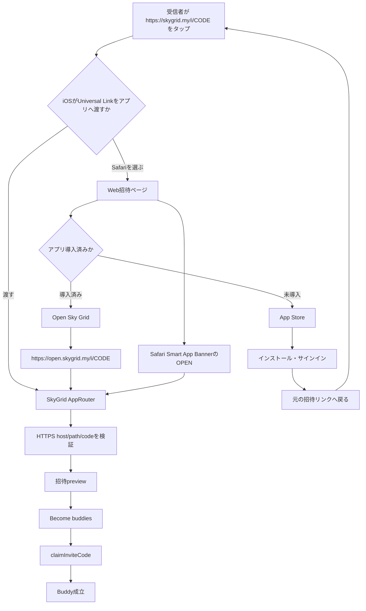

# Universal Links root-cause audit — 2026-09-08

## 結論

報告された「インストール済みでもWebへ行く」は、AASA欠落やURL parser破損ではなかった。
根本問題は、Universal Linksをインストール有無だけで決まる二分岐として設計し、iOSが正常に
Safariを選んだ後の復旧導線をWeb側に用意していなかったことだった。

Appleは次の場合、アプリが入っていてもSafariを維持する。

- Safariで現在と同じドメインのUniversal Linkをタップした場合
- 利用者が以前ステータスバーのbreadcrumbからWeb表示を選んだ場合。その選択はSmart App
  Bannerの`OPEN`を押すまで保持される
- リンク元アプリがUniversal Linkを通常のタップとして渡さず、独自Web表示を強制する場合

一次資料: [Apple Support Universal Links](https://developer.apple.com/library/archive/documentation/General/Conceptual/AppSearch/UniversalLinks.html)

## 確認した事実

- `https://skygrid.my/.well-known/apple-app-site-association`: 200、redirectなし、JSON
- `https://skygrid.my/apple-app-site-association`: 200、redirectなし、同じJSON
- Apple CDN `https://app-site-association.cdn-apple.com/a/v1/skygrid.my`: 200、origin取得元も正しい
- AASA app ID: `NVZB82UK53.com.takmin.skygrid`
- AASA対象: `/i/*`
- App Store提出用1.0.5 build 9 IPA: `applinks:skygrid.my` entitlementあり
- アプリのbundle ID/team prefix、AASA app ID、署名entitlementは一致
- `AppRouter`は`onOpenURL`と`NSUserActivityTypeBrowsingWeb`の両方を受ける
- `InviteLinkParser`は正しいHTTPS招待URLを受理する

したがって、サーバー契約、署名、アプリ内受信処理のいずれにも、全端末を常時Webへ送る静的な
不一致は確認できなかった。報告端末がどのSafari選択状態またはリンク元WebViewにいたかは、
対象端末でのログ採取がないため未確定。

## 修正後のワークフロー

## 実装

- Web招待ページへ`Open Sky Grid`を追加
- 復旧URLを別Associated Domainの`https://open.skygrid.my/i/{code}`に限定
- iOS parserは`skygrid.my`と`open.skygrid.my`のHTTPS、単一path、正規InviteCodeだけを許可
- custom schemeは別アプリが同じschemeを登録できるため、invite codeを載せない
- Universal Link受信とfallback復旧受信をコードやUIDなしで別イベント計測
- site検証スクリプトへAASA、Smart App Banner、復旧URLの契約検査を追加

## 検証と未完了

- waitlist TypeScript typecheck: 成功
- ローカルCloudflare Workerの全ページ・asset・AASA・招待ページ契約: 成功
- iOS focused tests: 成功
- 本番Workerへのdeploy、App Store buildの提出は未実施。リポジトリ規則により明示承認が必要。
- 本番効果はCloudflareの`/i/*`着地数と、`link_opened` / `fallback_recovered` /
  `preview_viewed`を同期間で比較する。現在値は未測定。
